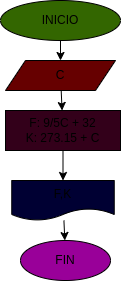

# TEMPERATURA
programa 

## calcular mediante grados celsuis los grados fahrenheit y los grados kevin 

# ANALISIS

variable de entrada (input)

C: grados celsius

Variable de proceso y salida 
(processing, storage, outpur)

F: grados fahrenheit 
K: grados kelvin

# DISEÑO

# CONTRUCCIION 

